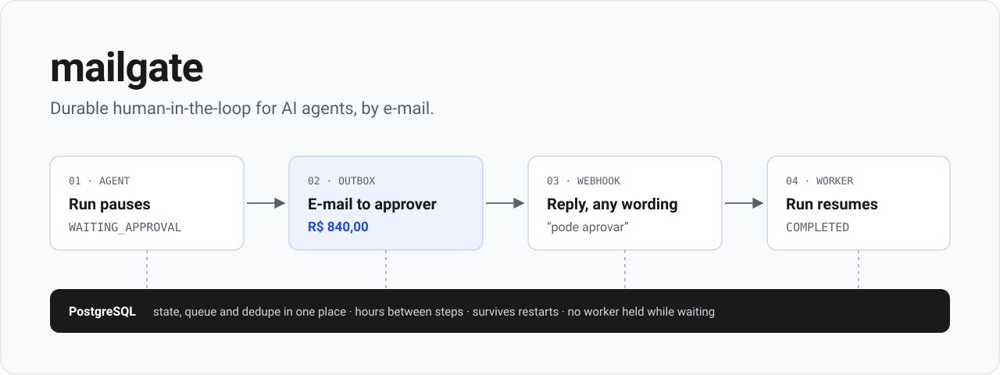
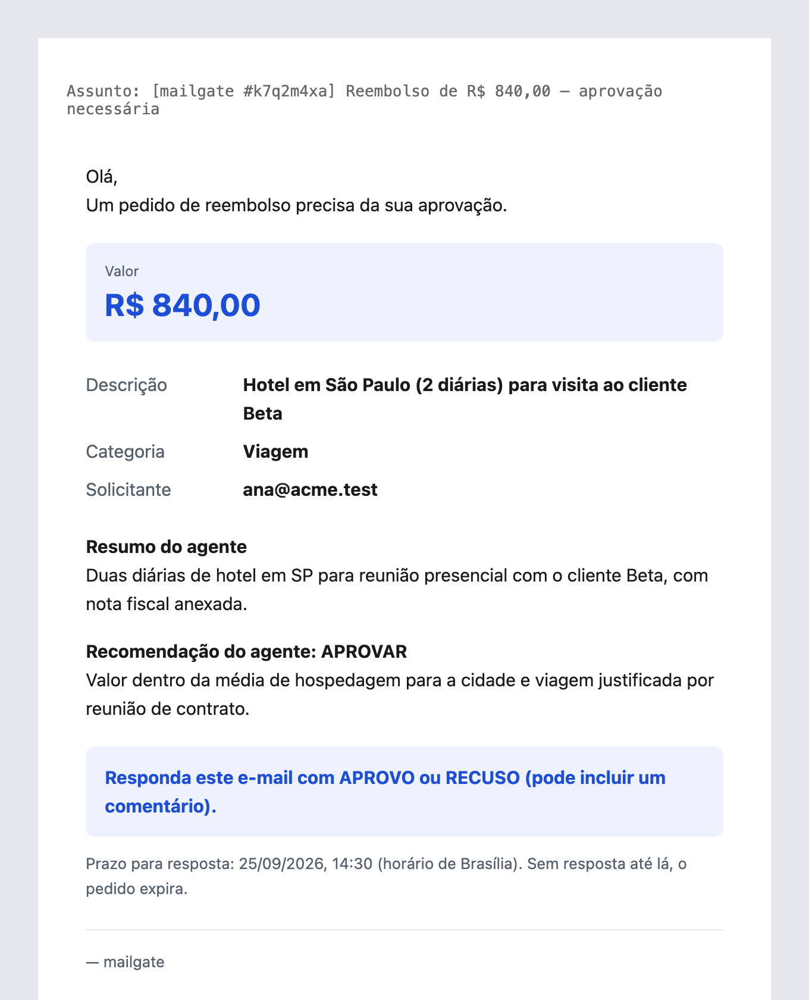
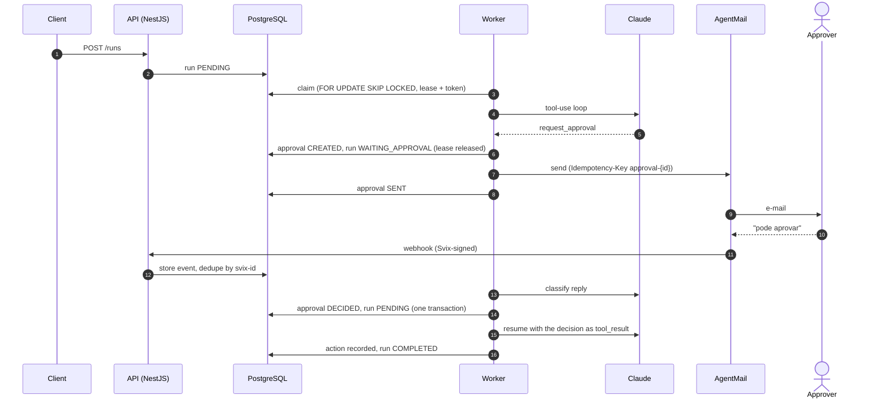
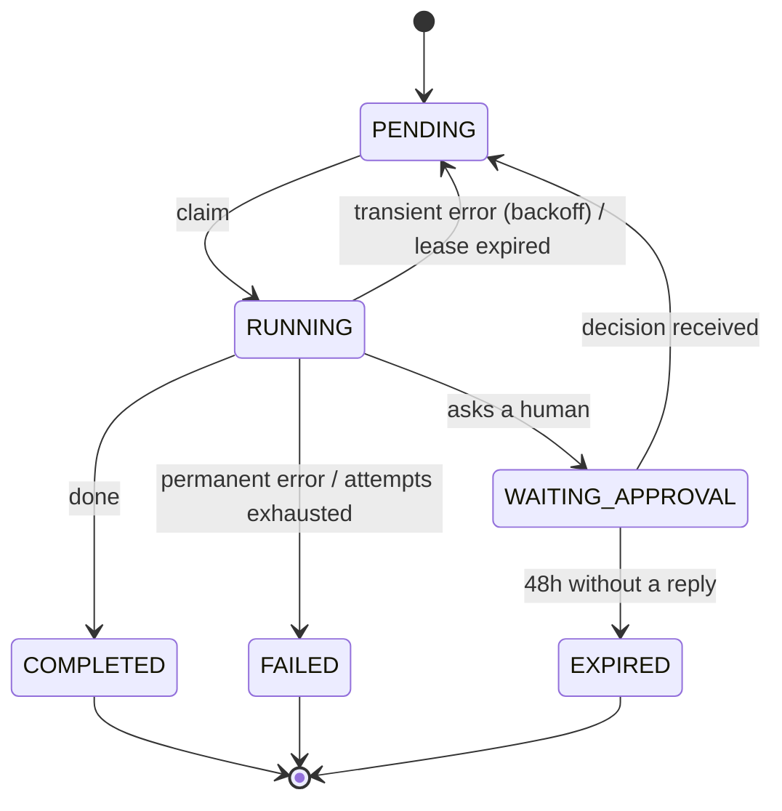

<p align="center">
  
</p>

<p align="center">
  <a href="https://github.com/robertobferraz/mailgate/actions/workflows/ci.yml"></a>
  
  
  
  
</p>

# mailgate

**Durable human-in-the-loop for AI agents, by e-mail.**

An agent works on a task, reaches a decision it is not allowed to make alone, e-mails a person, and stops. When the reply lands — minutes or two days later, after any number of restarts or deploys — the agent picks up exactly where it left off and acts on the decision. Nothing waits in memory, and no worker is held while the human thinks.

The demo domain is expense reimbursement:

- The agent reviews each request (description, amount, category).
- It approves up to **R$ 500** on its own, and may reject on its own.
- Above R$ 500 it writes a summary and a recommendation and e-mails the manager.
- The manager answers in plain language — *"pode aprovar"*, *"recusa, falta nota fiscal"* — and the agent records the decision as an action.

No money moves. The point is the mechanics: **pause, resume, duplicates, races and expiry**, done right.

## What the approver sees

<p align="center">
  
</p>

One restrained e-mail, written for a busy person on a phone: the amount and the reply instruction are the only accented elements, and the agent's recommendation is deliberately colorless so it does not nudge the decision. If a reply can't be read as approve or reject, mailgate asks once, in the same thread.

## How it works



The run's whole conversation with the model is stored append-only, so a resume is just "load history, add the decision as the pending `tool_result`, keep going." The webhook never decides inline: it verifies, stores and returns 200; the worker does the thinking.



## Guarantees

Each invariant has at least one integration test against a real PostgreSQL (Testcontainers), and `npm run test:stress` repeats the concurrency suites 20 times to shake out flaky races.

| | Invariant | How | Proven in |
|---|---|---|---|
| **I1** | An agent action runs at most once per `(run_id, tool_use_id)` | unique key + tool call persisted before it executes | [`agent-decision`](test/agent/agent-decision.int-spec.ts) |
| **I2** | An approval request gets at most one decision | `FOR UPDATE` on the approval, state checked in the same transaction | [`decision.concurrency`](test/inbound/decision.concurrency.int-spec.ts) |
| **I3** | A webhook event is processed at most once | provider event id is a unique key | [`webhook`](test/inbound/webhook.int-spec.ts), [`processor`](test/inbound/processor.int-spec.ts) |
| **I4** | At most one worker processes a run at a time | lease + fencing token on every write; LLM calls bounded below the lease | [`claim.concurrency`](test/worker/claim.concurrency.int-spec.ts) |
| **I5** | A run waiting for approval holds no worker | lease cleared on `WAITING_APPROVAL` | [`agent-pause`](test/agent/agent-pause.int-spec.ts) |
| **I6** | Only the registered approver's address can decide | sender checked against the request before classification | [`processor`](test/inbound/processor.int-spec.ts) |

Plus: e-mail is never sent inside a transaction (send, then mark, with an idempotency key); expiry races safely with a late decision; the R$ 500 rule is enforced in code, not just in the prompt.

## Quickstart

```bash
cp .env.example .env        # set LLM_* and AGENTMAIL_* for the real flow
docker compose up --build   # postgres → migrations → api + worker
curl localhost:3000/health  # {"status":"ok"}
```

Port 3000 taken? `API_PORT=3001 docker compose up --build`.

Create a run:

```bash
curl -s localhost:3000/runs -H 'content-type: application/json' -d '{
  "description": "Hotel em SP para visita a cliente",
  "amountCents": 84000,
  "category": "TRAVEL",
  "requesterEmail": "ana@acme.test",
  "approverEmail": "you@example.com"
}'
# {"id":"…","status":"PENDING"}

curl -s localhost:3000/runs/<id>   # status, approval, action and full timeline
```

For replies to reach mailgate, point the AgentMail webhook at a public URL for `POST /webhooks/mail` (e.g. through ngrok) and set `AGENTMAIL_WEBHOOK_SECRET`. The full end-to-end walkthrough is in [docs/e2e.md](docs/e2e.md).

## Configuration

| Variable | Default | Purpose |
|---|---|---|
| `DATABASE_URL` | — | PostgreSQL connection string |
| `WORKER_ENABLED` | `true` | run the worker loops in this process |
| `LLM_PROVIDER` | `anthropic` | `anthropic`, or `anthropic-compatible` (e.g. Ollama) with `LLM_BASE_URL` |
| `LLM_MODEL` | `claude-opus-5` | model id |
| `LLM_API_KEY` | — | API key for the provider |
| `LLM_TIMEOUT_MS` | `90000` | per-call bound; must stay below `LEASE_SECONDS` |
| `AGENTMAIL_API_KEY` / `AGENTMAIL_INBOX_ID` | — | outbound mail |
| `AGENTMAIL_WEBHOOK_SECRET` | — | Svix secret; without it every webhook is rejected |
| `AUTO_APPROVE_LIMIT_CENTS` | `50000` | amount the agent may approve alone (R$ 500,00) |
| `APPROVAL_TTL_HOURS` | `48` | how long an approval waits before expiring |
| `LEASE_SECONDS` / `MAX_ATTEMPTS` / `MAX_TURNS` | `120` / `5` / `10` | worker lease, retry budget, agent turn cap |

All variables are validated at startup ([`src/config/config.ts`](src/config/config.ts)).

## Development

```bash
npm ci && npx prisma generate
npm test             # unit
npm run test:int     # integration, real Postgres via Testcontainers (needs Docker)
npm run test:stress  # concurrency suites, 20 runs
npm run lint && npm run typecheck
```

## Project map

| | |
|---|---|
| Design spec | [docs/superpowers/specs/mailgate/design.md](docs/superpowers/specs/mailgate/design.md) |
| API contract | [docs/api/openapi.yaml](docs/api/openapi.yaml) |
| Architecture decisions | [docs/02-adr](docs/02-adr/README.md) — Prisma + raw SQL, Postgres queue with lease/fencing, async inbound, manual tool-use loop |
| Product decisions | [docs/03-pdr](docs/03-pdr/README.md) — auto-approve limit, expiry, reply policy, e-mail design |
| Conventions & lessons | [docs/04-conventions](docs/04-conventions/README.md) · [docs/05-lessons](docs/05-lessons/README.md) |
| Roadmap & backlog | [docs/roadmap.md](docs/roadmap.md) · [docs/00-backlog](docs/00-backlog/README.md) |

## Known limits

- **E-mail is not strong identity.** A forged sender who knows the approver's address and the subject token could pass as the approver. SPF/DKIM checks would be the next step in a real deployment.
- **The classifier can misread.** It defaults to `UNCLEAR` when in doubt, asks at most once, and stores the original text with every decision.
- **No auth on the API.** Multi-tenancy, login and an admin panel are out of scope for this demo.

## Status

Phases F0–F5 are done: foundation, runs and worker, agent, outbound mail, inbound webhook, expiry. Validated end to end against the real AgentMail API. F6 (public deploy, timeline page) is next — see [backlog 0001](docs/00-backlog/0001-f6-demo-and-publication.md).
